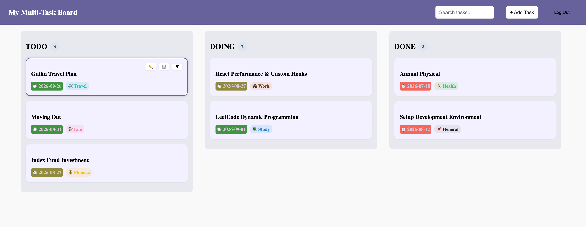
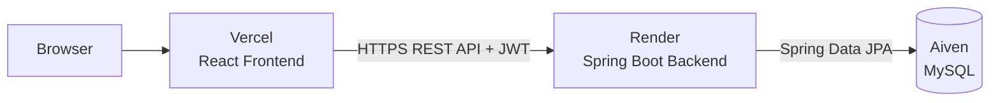
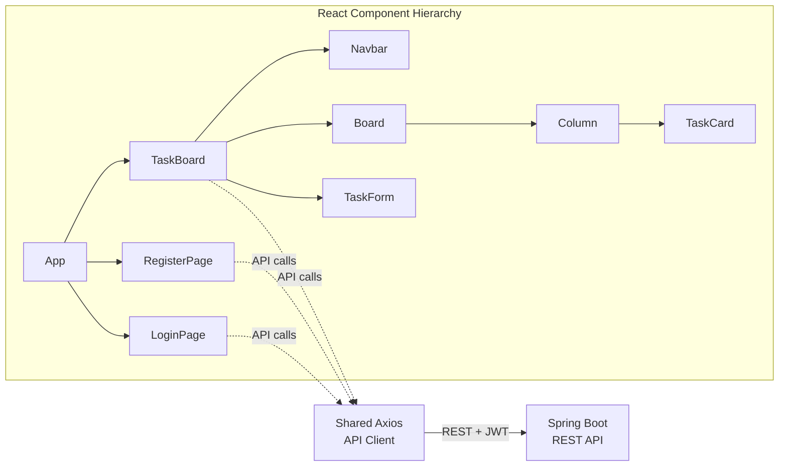
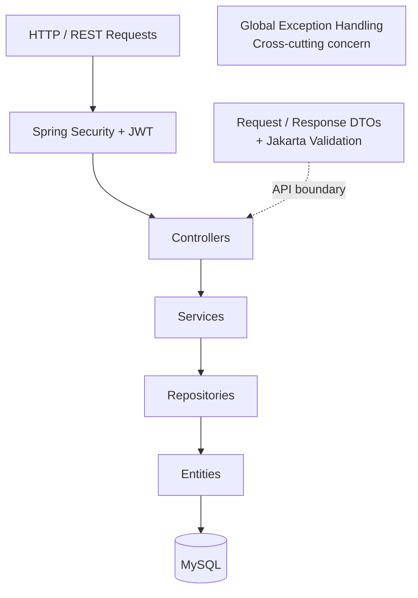
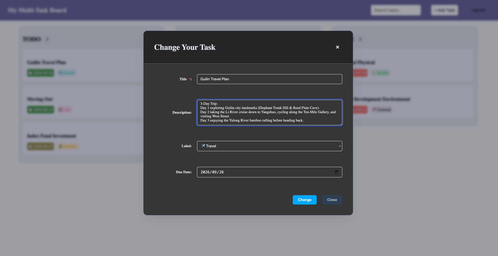
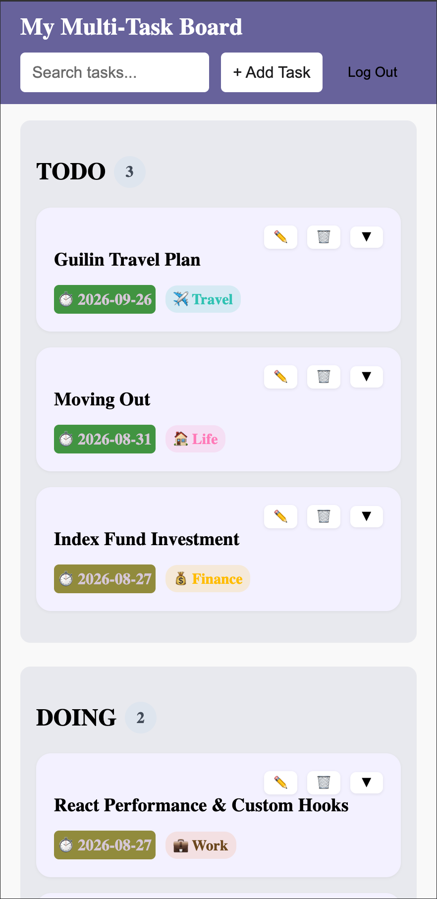
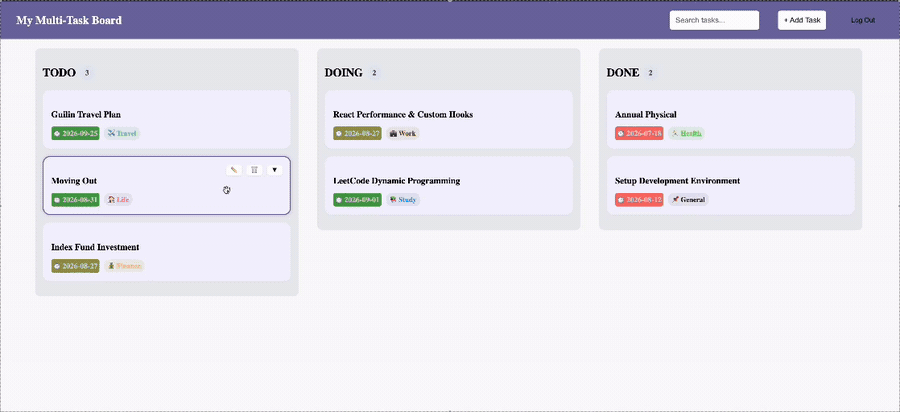
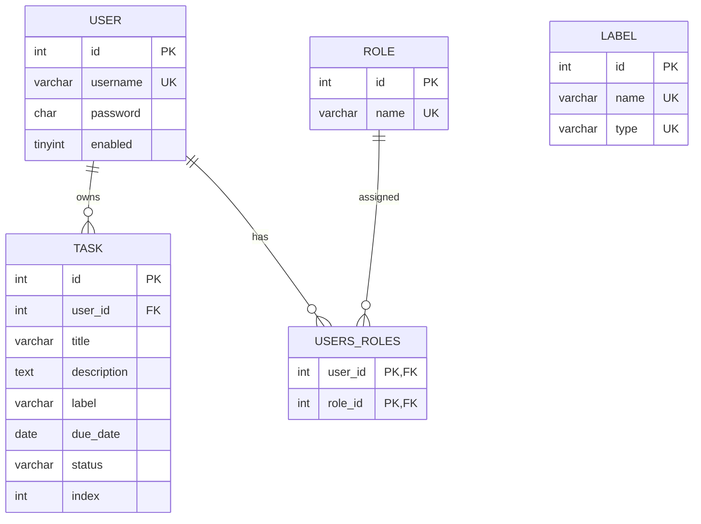

# Multi-Task Board

A full-stack task management application built with **React, Spring Boot, and MySQL**, featuring **JWT-based authentication, user-specific task management, and persistent drag-and-drop ordering**.

**Live Demo:** https://multi-task-board-frontend.vercel.app  
**Backend Repository:** https://github.com/VicTian1/multi-task-board-backend-portfolio  
**API Documentation:** https://multi-task-board-backend.onrender.com/swagger-ui/index.html

> **Note:** The backend is hosted on a free-tier service and may take up to about a minute to wake after a period of inactivity.



## Overview

Multi-Task Board is a full-stack web application for organizing personal tasks across **To Do**, **Doing**, and **Done** stages.

The application combines a component-based React frontend with a layered Spring Boot REST API and MySQL persistence. It supports authenticated, user-specific task management, persistent drag-and-drop ordering, task search, label and due-date metadata, validation, and centralized error handling.

The application is deployed as a complete production system, with the frontend, backend, and database hosted independently and connected through HTTPS REST APIs.

## Key Features

- **User authentication** — register, log in, log out, and maintain an authenticated session using JWT.
- **User-specific task management** — each authenticated user accesses and modifies only their own tasks.
- **Task CRUD** — create, view, edit, and delete tasks with titles, descriptions, labels, and due dates.
- **Three-stage workflow** — organize tasks across To Do, Doing, and Done columns.
- **Drag and drop** — reorder tasks within a column or move them across columns.
- **Persistent ordering** — task positions and status changes are persisted in the database and preserved after refresh.
- **Task search** — filter tasks by title.
- **Visual task metadata** — labels and due-date indicators provide quick visual context.
- **Interaction feedback** — loading states and toast notifications communicate successful operations and API errors to the user.

## Technical Highlights

### Secure Authentication and User-Scoped Authorization

Authentication is implemented with **Spring Security** and stateless **JSON Web Tokens (JWT)**. Passwords are hashed with BCrypt before persistence.

After a successful login, the backend issues a JWT that is stored by the client and automatically attached to authenticated API requests through an Axios interceptor. A custom JWT authentication filter validates incoming tokens and establishes the authenticated user context for protected requests. Authentication endpoints are publicly accessible, while the remaining application APIs require authentication.

Task operations are scoped to the authenticated user's ID, preventing one user from accessing or modifying another user's tasks.

### Persistent Drag-and-Drop Ordering

Drag-and-drop behavior is implemented with `@hello-pangea/dnd` and supports both same-column reordering and movement between workflow stages.

The frontend updates task positions immediately for responsive interaction and sends the resulting position and, when necessary, status to a dedicated move endpoint. The backend reindexes the affected task sequence(s) and persists the resulting order in MySQL, additionally updating the task status for cross-column moves.

If the API operation fails, the frontend performs a **rollback** to restore the previous task state, preventing the UI from remaining inconsistent with persisted server data.

### Client–Server State Synchronization

The React frontend maintains application state while treating the backend as the persistent source of task data.

Initial task and label data are loaded through the shared Axios API client. Create, update, delete, status-change, and drag-and-drop operations synchronize client state with REST endpoints. State updates are coordinated with API responses to maintain consistency between client-side interactions and persisted server data, with loading and error states providing feedback during asynchronous operations.

This keeps the interactive board responsive while maintaining consistency between browser state and persisted database state.

### Production Deployment and Environment Separation

The application separates local development configuration from production infrastructure through environment variables.

The React frontend uses an environment-specific API base URL, while the Spring Boot backend obtains database credentials, JWT secrets, and CORS origins from its deployment environment rather than hard-coded credentials.

## Architecture

### System Architecture



### Frontend Architecture



`App` controls the application's authentication-level view, while `TaskBoard` coordinates the main board state and task interactions. Lower-level components focus on presentation and specific user interactions, while a shared Axios client centralizes communication with the backend.

### Backend Architecture



The backend follows a layered architecture that separates HTTP request handling, business logic, persistence, and database access. DTOs define the API boundary, with Jakarta Validation enforcing request constraints before validated data enters the application flow.

Spring Security and JWT authentication protect application endpoints before requests reach the controllers, while centralized exception handling converts validation, application, and unexpected errors into consistent HTTP responses.

## Tech Stack

| Layer | Technologies |
| --- | --- |
| **Frontend** | React, JavaScript, Vite, Axios, `@hello-pangea/dnd`, CSS |
| **Backend** | Java, Spring Boot, Spring Security, Spring Data JPA, Jakarta Validation |
| **Database** | MySQL |
| **API & Documentation** | REST, JWT, OpenAPI / Swagger UI |
| **Deployment & Infrastructure** | Docker, Vercel, Render, Aiven |

## Screenshots

### Task Editing



### Responsive Mobile Layout



### Drag-and-Drop and Task Interaction



## API Documentation

Interactive API documentation is available through **Swagger UI**:

**Swagger UI:** https://multi-task-board-backend.onrender.com/swagger-ui/index.html

The REST API includes endpoints for:

- authentication and registration;
- task creation, retrieval, update, and deletion for the authenticated user;
- task status changes and persistent reordering;
- task labels.

Protected endpoints require a valid JWT.

## Database Design

The application uses a relational MySQL schema that separates authentication, authorization, task data, and predefined label metadata.

Users and roles form a many-to-many relationship through the `users_roles` junction table, while each task is owned by a single user through the `user_id` foreign key. Task ownership uses `ON DELETE CASCADE`, ensuring that a user's tasks are removed when the owning user is deleted.

A composite index on `(user_id, status, index)` supports efficient retrieval of a user's tasks by workflow status and persisted board order.

### Entity–Relationship Diagram



`LABEL` is maintained as predefined reference data. Tasks store the corresponding label type value rather than a foreign-key reference to the `label` table.

## Local Setup

### Prerequisites

- Node.js and npm
- Java 17+
- MySQL
- Git

### 1. Clone the repositories

```bash
git clone https://github.com/VicTian1/multi-task-board-frontend.git
git clone https://github.com/VicTian1/multi-task-board-backend-portfolio.git
```

### 2. Set up the database

Create the local MySQL database and run the SQL scripts in order:

```text
src/main/resources/sql-scripts/01-create-database.sql
src/main/resources/sql-scripts/02-create-security-tables.sql
src/main/resources/sql-scripts/03-create-label-table.sql
src/main/resources/sql-scripts/04-create-task-table.sql
```

### 3. Configure the backend

Provide the required environment variables:

```text
DB_USERNAME=<your-mysql-username>
DB_PASSWORD=<your-mysql-password>
JWT_SECRET=<your-jwt-secret>
```

Optional configuration includes:

```text
DB_URL=jdbc:mysql://localhost:3306/task_tracker
JWT_EXPIRATION_MS=86400000
FRONTEND_URL=http://localhost:5173
PORT=8080
```

Then start the Spring Boot application:

```bash
./mvnw spring-boot:run
```

### 4. Configure the frontend

Create the frontend environment configuration using `.env.example`:

```text
VITE_API_BASE_URL=http://localhost:8080
```

Install dependencies and start the development server:

```bash
npm install
npm run dev
```

The frontend will then communicate with the locally running Spring Boot API.

## Deployment

The production application is deployed across three cloud services:

```text
Vercel  →  React frontend
Render  →  Dockerized Spring Boot backend
Aiven   →  MySQL database
```

Production configuration is supplied through environment variables rather than committed credentials. CORS is configured through Spring Security to allow requests from the deployed frontend origin.

> **Cold-start note:** The backend currently uses a free-tier Render instance. After a period of inactivity, the first request may take up to about a minute while the service wakes. Subsequent requests are normally much faster.